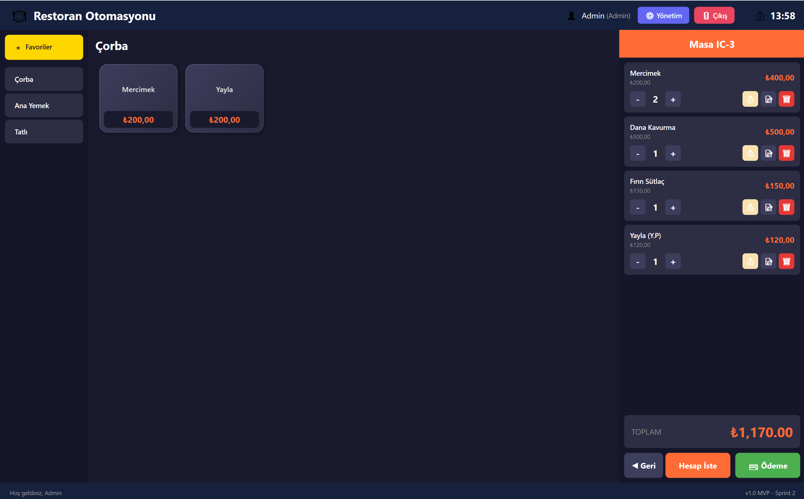
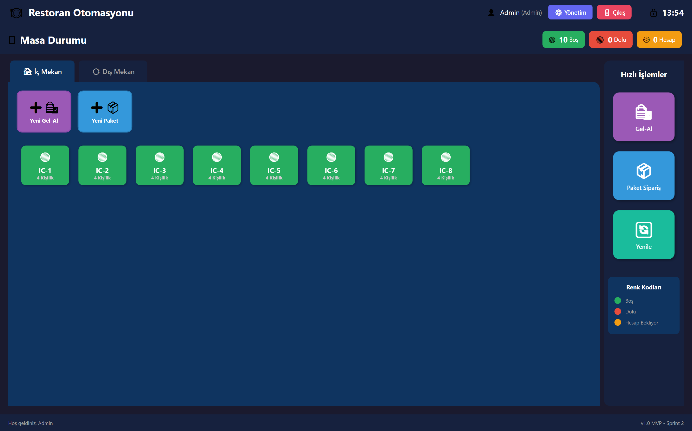

<div align="center">

# 🍽️ Restoran Otomasyonu

### Modern Restoran Yönetim Sistemi

[](https://dotnet.microsoft.com/)
[](https://docs.microsoft.com/en-us/dotnet/desktop/wpf/)
[](https://www.sqlite.org/)
[](LICENSE)

<br/>

**Restoranınızı kolayca yönetin!**  
Masa takibi • Sipariş yönetimi • Raporlama • Fiş yazdırma

<br/>

[📥 **İNDİR**](../../releases/latest) &nbsp;&nbsp;•&nbsp;&nbsp; [📖 Dokümantasyon](#-kurulum) &nbsp;&nbsp;•&nbsp;&nbsp; [🐛 Hata Bildir](../../issues)

---

</div>

<br/>

## ⚡ Hızlı Başlangıç

```bash
1. Releases sayfasından ZIP indir
2. Çıkar ve RestoranOtomasyon.exe çalıştır
3. PIN: 1234 ile giriş yap
```

> 💡 **.NET kurulumu gerekmez** - Uygulama tüm bağımlılıkları içerir!

<br/>

## 🎯 Özellikler

<table>
<tr>
<td width="50%">

### 🍽️ Sipariş Yönetimi
- ✅ Masa bazlı sipariş takibi
- ✅ Gel-Al & Paket sipariş desteği
- ✅ Yarım porsiyon seçeneği
- ✅ Anlık fiyat değiştirme
- ✅ İkram yönetimi

</td>
<td width="50%">

### 📊 Yönetim & Raporlama
- ✅ Günlük/aylık satış raporları
- ✅ Toplu fiyat güncelleme (zam/indirim)
- ✅ Kategori ve ürün yönetimi
- ✅ Kullanıcı rolleri (Admin/Garson)
- ✅ Fiş yazdırma

</td>
</tr>
</table>

<br/>

## 🖥️ Ekran Görüntüleri

<div align="center">
<table>
<tr>
<td align="center"><b>🏠 Masa Ekranı</b></td>
<td align="center"><b>📝 Sipariş Ekranı</b></td>
</tr>
<tr>
<td></td>
<td></td>
</tr>
</table>
</div>

<br/>

## 📥 Kurulum

### Hazır Paket (Önerilen)

| Adım | Açıklama |
|:----:|----------|
| 1️⃣ | [**Releases**](../../releases/latest) sayfasından ZIP indir |
| 2️⃣ | İstediğin klasöre çıkar |
| 3️⃣ | `RestoranOtomasyon.exe` çalıştır |
| 4️⃣ | PIN: `1234` ile giriş yap |

### Kaynak Koddan Derleme

```bash
# Klonla
git clone https://github.com/ec4tes/restoran-otomasyon.git

# Çalıştır
cd restoran-otomasyon/src/RestoranOtomasyon
dotnet run

# Release build
dotnet publish -c Release -r win-x64 --self-contained true -p:PublishSingleFile=true
```

<br/>

## 🔧 Sistem Gereksinimleri

| Gereksinim | Minimum |
|------------|---------|
| 💻 İşletim Sistemi | Windows 10/11 (64-bit) |
| 🧠 RAM | 4 GB |
| 💾 Disk | 200 MB |
| ⚙️ .NET | Gerekmez (Self-contained) |

<br/>

## 🛠️ Teknolojiler

<div align="center">

| Teknoloji | Kullanım |
|:---------:|:--------:|
|  | Framework |
|  | UI Framework |
|  | Veritabanı |
|  | Programlama Dili |

</div>

<br/>

## 📁 Proje Yapısı

```
📦 restoran-otomasyon
├── 📂 src/RestoranOtomasyon
│   ├── 📂 Data/           # Veritabanı işlemleri
│   ├── 📂 Models/         # Entity sınıfları
│   ├── 📂 Services/       # İş mantığı katmanı
│   ├── 📂 ViewModels/     # MVVM ViewModels
│   ├── 📂 Views/          # XAML arayüzleri
│   └── 📂 Converters/     # Value Converters
├── 📄 README.md
└── 📄 LICENSE
```

<br/>

## 🔐 Varsayılan Giriş

<div align="center">

| 👤 Rol | 🔑 PIN |
|:------:|:------:|
| Admin | `1234` |

</div>

<br/>

## 🤝 Katkıda Bulunma

Katkılarınızı bekliyoruz! 

1. 🍴 Fork yapın
2. 🌿 Feature branch oluşturun (`git checkout -b feature/YeniOzellik`)
3. 💾 Commit edin (`git commit -m 'Yeni özellik eklendi'`)
4. 📤 Push edin (`git push origin feature/YeniOzellik`)
5. 🔃 Pull Request açın

<br/>

## 📄 Lisans

Bu proje **MIT** lisansı altındadır. Detaylar için [LICENSE](LICENSE) dosyasına bakın.

<br/>

---

<div align="center">

**[ec4tes](https://github.com/ec4tes)** tarafından ❤️ ile geliştirildi

⭐ Beğendiysen yıldız vermeyi unutma!

</div>
